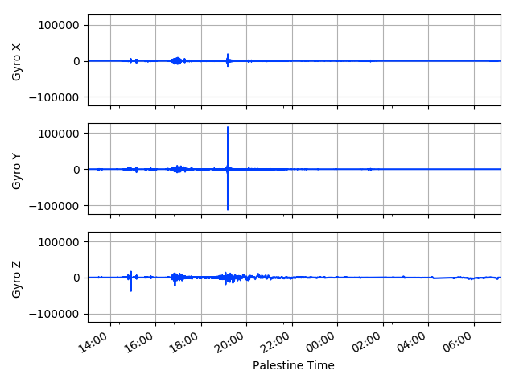
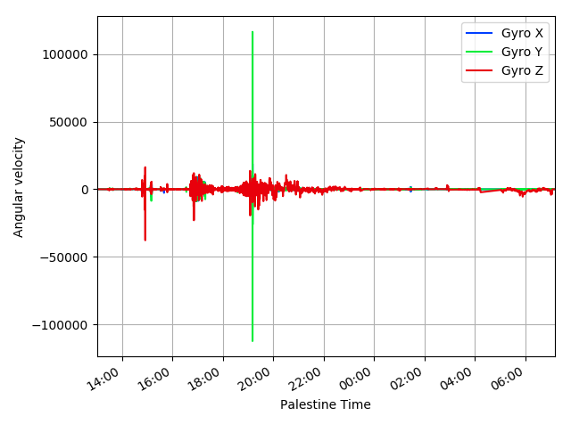

Introduction
############
Welcome to Python Flight Data Processing's documentation! This project is intended to make the life 
easier when plotting and analyzing some data of the Aurora archives.

The three main classes that were created for this project are:

* :class:`~utils.field.Field`, describes a field
* :class:`~utils.dataset.DataSet`, implements the process of reading a list of fields from a folder or a list of folders
* :class:`~utils.estimators.Estimator`, estimates the attitude using the sensors data and has methods to plot the results

Another common class is :class:`~utils.quat.Quat`, that provides easy  manipulation of quaternion objects. This project also relays heavily on the `matplotlib`_ for the plots and on the `pandas`_ modules, as it uses the ``pandas.DataFrame`` data structure to store the time-series information. 

Example
==============
A good start to understand better how all of this works is with a simple example. The following code is available at :mod:`scripts.plotField` and plots directly the gyroscopes data::

	from utils.config import flightDisksFolders,plt
	from utils.dataset import DataSet,pd, plotColumns
	from utils.field import Field

	folders=flightDisksFolders

	fieldsList=[]
	fieldsList.append(Field('bettii.GyroReadings.angularVelocityX',label='Gyro X',conversion=0.0006304))
	fieldsList.append(Field('bettii.GyroReadings.angularVelocityY',label='Gyro Y',conversion=0.0006437,range=2e5))
	fieldsList.append(Field('bettii.GyroReadings.angularVelocityZ',label='Gyro Z',conversion=0.0006324,range=2e5))

	ds = DataSet(fieldsList=fieldsList,foldersList=folders,verbose=True,rpeaks=False)

	M=100
	ds.df = ds.df.iloc[::M] #Downsample

	print "Converting to Palestine Time..."
	ds.df.index = ds.df.index - pd.Timedelta(hours=5)  # Palestine time conversion (Archives folder names are in UTC)

	print "Cropping time"
	time_start=pd.datetime(2017, 6, 8, 13)
	time_end=pd.datetime(2017, 6, 9, 10)
	ds.df = ds.df.loc[time_start:time_end]

	time_label = 'Palestine Time'

	print "Plotting.."
	plotColumns(ds.df,xlabel=time_label)

	plotColumns(ds.df,xlabel=time_label,ylabels=['Angular velocity'],ncols=0)

	print "Show..."
	plt.show()

After running the previous script we will obtain two new figures:

Now we will analyze in more detail the different parts of the script.

Imports::

	from utils.config import flightDisksFolders,plt
	from utils.dataset import DataSet,pd, plotColumns
	from utils.field import Field

The goal of these imports is to load in our environment some names that will be used later.
When we run the first line, the module utils.config runs and we keep the variables ``flightDisksFolders``-- a list of Archive folder names-- and ``plt`` -- the matplotlib.pyplot object already configured --.

After the imports, a list of fields is generated::

	fieldsList=[]
	fieldsList.append(Field('bettii.GyroReadings.angularVelocityX',label='Gyro X',conversion=0.0006304))
	fieldsList.append(Field('bettii.GyroReadings.angularVelocityY',label='Gyro Y',conversion=0.0006437,range=2e5))
	fieldsList.append(Field('bettii.GyroReadings.angularVelocityZ',label='Gyro Z',conversion=0.0006324,range=2e5))

Each Field is constructed in a similar manner. If we focus on the second gyroscope, we are defining a custom label ``Gyro Y`` that will be used as the column name in the generated dataframe and also as the default label for the legends in the plots. The ``conversion`` keyword argument is a factor that will be multiplied at every data point in the field. In the case of the gyroscopes this conversion is performed to obtain the information in arcsec/s units. Finally, the ``range`` parameter defines a valid range for the data. If there is any data point outside +-range, it will be discarded. This is useful to filter some undesired parsing errors.

All the reading process of the different files is performed inside the DataSet construction::

	ds = DataSet(fieldsList=fieldsList,foldersList=folders,verbose=True,rpeaks=False)

The line is quite self-explanatory. After running succesfully this part, we will have a ``pandas.Dataframe`` at the attribute ``ds.df``. If the verbose argument is ``True`` we will see the evolution of the reading process in our console. The only confusing term is ``rpeaks``. This option, when it is True, will remove all the instants where the absolute value of all the fields in the dataframe are below 1. The reason behind that is because there are some group of fields that suddenly jump to values close to 0 at the same exact time.

When dealing with large amounts of data, the handling of the plots can be very slow. For that reason, a downsample is performed before calling the plotting functions::

	M=100
	ds.df = ds.df.iloc[::M] #Downsample

In this case we are picking one sample of every 100.

When merging multiple folders, the indexing of the generated dataframe is always in time, not in frame numbers. That is because between folders, a reset of the frame number counter can occur.
If we only read from a single folder, the ``timeIndex`` argument of DataSet decides wether we use frame numbers or time. The option by default is to use the frame numbers.

The time information is extracted from the folders name. If we use the disks folders, the time zone will be different. That is why we substract 5 hours to obtain the time at the launch site::

	print "Converting to Palestine Time..."
	ds.df.index = ds.df.index - pd.Timedelta(hours=5)  # Palestine time conversion (Archives folder names are in UTC)

The ``pandas`` library offers a easy way to slice dataframes::

	print "Cropping time"
	time_start=pd.datetime(2017, 6, 8, 13)
	time_end=pd.datetime(2017, 6, 9, 10)
	ds.df = ds.df.loc[time_start:time_end]
	
Here, we are getting the data that is only between 2017/06/08 13:00 and 2017/06/09 10:00.

External documentation
======================

* `Pandas Documentation <https://pandas.pydata.org/pandas-docs/stable/>`_
* `Matplotlib Tutorials <https://matplotlib.org/users/tutorials.html>`_

.. _pandas: https://pandas.pydata.org/pandas-docs/stable/
.. _matplotlib: https://matplotlib.org/index.html
.. _dataframe: https://pandas.pydata.org/pandas-docs/stable/dsintro.html#dataframe
