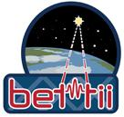

#  Python code to Analyze Telemetry data from the BETTII.
This software is developed for the Ballon Experimental Twin Telescope for Infrared Inferferometry project (BETTII), at NASA Goddard Space Flight Center.

1. Fields created from Protobuf fields (Aurora, BETTII's flight software)
2. The code is a tool to analyze the Attitude controls System estimator performance as well as any other information coming from the Telescope (Temperatures, power consumption, Griffin Angles, Mode of Operation, FPGA timing performance, etc.)

>**NOTE:** for more info see .proto files under bettii/protobuf
